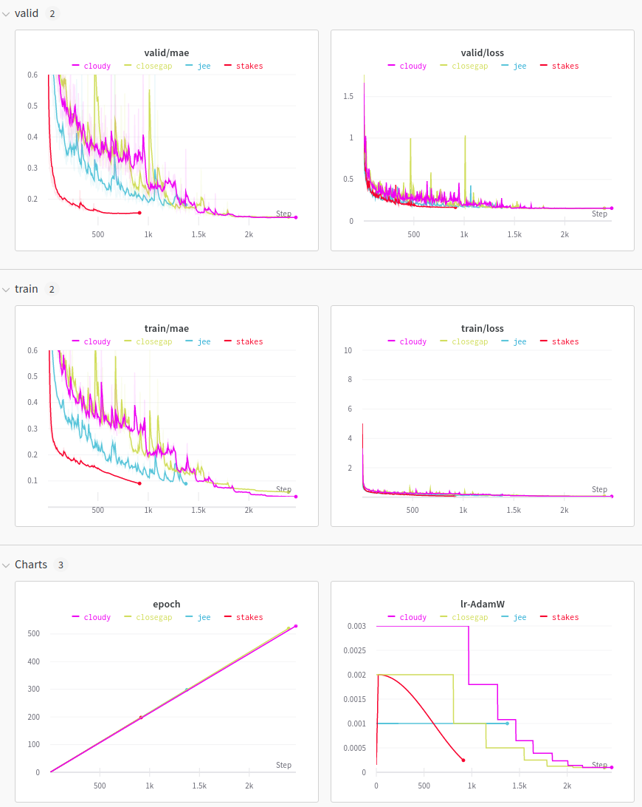

# Part of 1st place solution (Simple LSTM) of Google-Brain-Ventilator competition

<a href="https://pytorch.org/get-started/locally/"></a>
<a href="https://pytorchlightning.ai/"></a>
<a href="https://hydra.cc/"></a>
<a href="https://github.com/ashleve/lightning-hydra-template"></a><br>
[](https://www.nature.com/articles/nature14539)
[](https://papers.nips.cc/paper/2020)

</div>

NOTE: This code is based the [lightning-hydra-template](https://github.com/ashleve/lightning-hydra-template). Give it a try!

## Description
Simple LSTM model used in the https://www.kaggle.com/c/ventilator-pressure-prediction competition.

This is the first (out of two) model we used for the strong ensemble in the ventilator-pressure-prediction competition.
This model is the one that is probably the easiest to explain, but also the one that resulted in the best LB score of 0.1209. It is based on the starter notebook from [starter notebook from theoviel](https://www.kaggle.com/theoviel/deep-learning-starter-simple-lstm). It uses the following 9 features: 
- u_in
- u_out
- time_step
- dummy features for R (3) and C (3)

the featurize function is contained in [here](src/datamodules/features/simple.py) and yes! that is all!
You can find how the dataset is generate in the [datamodule](src/datamodules/datamodule.py). 

The current model is trained using a ReducelrOnPlateau with high patiente (30 epochs!)
Why? May you ask. While we were working on the network training we noted that fancy features may not be "all we need" in this comp. In particular all the fast annealeing scheduler we tried were easily overfitting the training the data, but the validation MAE was not decreasing as fast.

In the following graphs you can clearly see the red experiments named "stakes". "stakes" converged much faster but validation MAE stopped at more than 0.150 (that is really high). All the others experiments we tried, letting the model training at higher lr were in hte end better, converging at validation MAE < 0.135. 

The "cloudy" (pink) model reaches nearly 0.135 for every fold.




The model configurations can be found [configs/experiments](configs/experiment)

## How to run
Install dependencies
```yaml
# clone project
git clone https://github.com/whoknowsB/google-brain-ventilator-pressure-prediction
cd google-brain-ventilator-pressure-prediction

# [OPTIONAL] create conda environment
bash bash/setup_conda.sh

# install requirements
pip install -r requirements.txt
```

Download and extract the [model weights](https://drive.google.com/file/d/1WNaKe3LMpQbLBL8ronb1XHUGmUjqrVxG/view?usp=sharing) in the root directory. You should have a structure that looks like `this google-brain-ventilator-pressure-prediction/logs/experiments/`

Update the dataset directory in the file [configs/config.yaml](configs/config.yaml)
```yaml
# path to folder with data
data_dir: /input/ventilator-pressure-prediction
```

Train model with chosen experiment configuration from [configs/experiment/](configs/experiment/)
```yaml
python run.py experiment=cloudy ++trainer.gpus=[0] ++datamodule.fold=0 
```

You can easily run all the folds by
```yaml
for fold in 0 1 2 3 4 5 6 7 8 9 10; do python run.py experiment=cloudy ++trainer.gpus=[0] ++datamodule.fold=$fold; done
```

You can easily get the oof and preds for a fold
```yaml
python run_inference.py experiment=cloudy ++trainer.gpus=[0] ++datamodule.fold=0
```

You can easily get all the oof and preds by fold using:
```yaml
for fold in 0 1 2 3 4 5 6 7 8 9 10; do python run_inference.py experiment=cloudy ++trainer.gpus=[0] ++datamodule.fold=$fold; done
```
oof and preds will be save inside the logs/experiments/cloudy/*fold_number*


To easily gather all the oofs and preds we suggest to use the [notebook folding](notebooks/folding.ipynb), just replace the model name, and the folds you need.

```python
names = ['cloudy'] 
folds = range(11) # [0,1,2,3]
```

<br>
